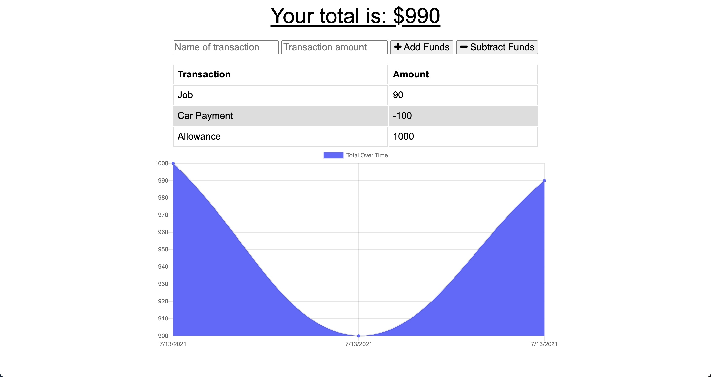

# budget-tracker
[](https://opensource.org/licenses/MIT)

 The budget tracker is an app that can allow the user to calculate expenses. Through this PWA app is created though using MongoDB, Mongoose and Express. This app is a PWA because it is able to cache data and be availaible online and offline.

## Table of Contents
  - [Table of Contents](#table-of-contents)
  - [Installation](#installation)
  - [Usage](#usage)
  - [Features](#features)
  - [License](#license)
  - [Contributing](#contributing)
  - [Screenshots](#screenshots)
  - [Questions](#questions)

## Installation
1. Clone this GitHub repository

2. Install all dependent npm packages

   ```
   npm install --save
   ```
3. Create a MongoDB database
5. If running on a server or hosting platform add the MONGODB_URI with connection string to the environment variables


## Usage
1. Run `npm start` to start the application
2. Type in an expense
3. subtract from total
4. Type in funds
5. add funds
6. Go to inspect, click on application, check "offline"

A demo of the application is available at: https://budget-tracker-1402.herokuapp.com/

## Features
* Add a funds
* Minus funds
* Graph to view trends
* Offline caching capabilities


## License
This project uses the MIT license
## Screenshots
**Home Page**



## Questions
Checkout my GitHub [profile](https://github.com/ryanpaynt)

Email me at: rpaynter@outlook.com